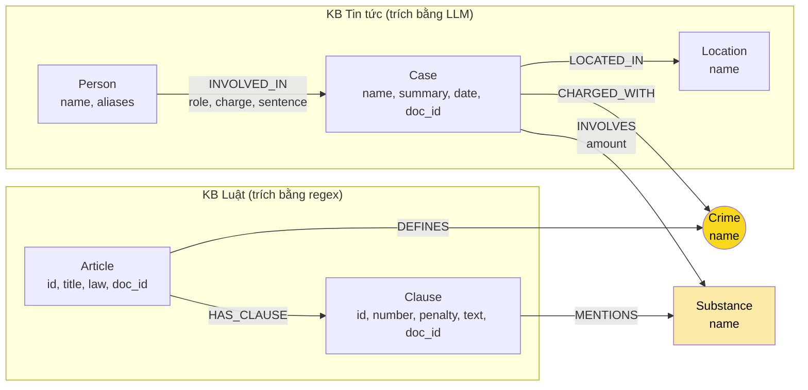

# Thiết kế Ontology — Day 19

**Họ tên:** Bùi Quốc Việt  **MSSV:** 2A202602884

**Lựa chọn** (đánh dấu một):
- [x] Dùng ontology gợi ý (có thể chỉnh nhỏ)
- [ ] Tự thiết kế (xét bonus +15, xem `SUBMISSION.md`)

> Hướng dẫn: `LAB_GUIDE.md` Bước 2. Dùng ontology gợi ý thì vẫn phải điền đủ các mục dưới đây bằng lời của bạn.

## 1. Sơ đồ

Node cầu nối là `Crime` (tô vàng). `Substance` là điểm nối phụ: vừa được khoản luật `MENTIONS`, vừa được vụ án `INVOLVES`.

## 2. Entity types (node labels)

| Label | Ý nghĩa | Khóa định danh (`MERGE` theo) | Properties | Lấy từ KB nào | Trích bằng (regex / LLM / khác) |
| --- | --- | --- | --- | --- | --- |
| `Article` | Một Điều luật (BLHS Chương XX hoặc Luật PCMT 2021 Chương I) | `id`, ví dụ `"Điều 251 BLHS"` (lấy từ front matter `article`) | `title`, `law`, `doc_id` | Luật | Regex / metadata (`parse_law_article`) |
| `Clause` | Một khoản của Điều, mang khung hình phạt | `id`, ví dụ `"Điều 251 BLHS khoản 1"` | `number`, `penalty`, `text`, `doc_id` | Luật | Regex `^(\d+)\.\s` tách khoản; regex `bị (phạt…)` lấy `penalty` |
| `Crime` | Tội danh đã chuẩn hóa, **node cầu nối** | `name` sau `normalize_crime` (chữ thường, bỏ tiền tố "Tội "), ví dụ `"mua bán trái phép chất ma túy"` | `name` | Luật (tiêu đề Điều BLHS); tin tức chỉ nối vào, không tạo tên mới | Regex trên tiêu đề + `link_entity` cho phía tin tức |
| `Substance` | Loại chất ma túy | `name` (tên chuẩn trong danh sách `SUBSTANCES`, ví dụ `"MDMA"`, `"Ketamine"`) | `name` | Cả hai | Luật: so khớp chuỗi (`find_substances`); tin: LLM, được nhắc dùng tên chuẩn |
| `Case` | Một vụ việc được kể trong bài báo | `name` do LLM đặt, ví dụ `"Vụ mua bán 36kg ma túy tại TP.HCM"` | `summary`, `date`, `doc_id`, `source_title` | Tin tức | LLM → JSON (`extract_news_cases`) |
| `Person` | Bị cáo, bị can, nghi phạm, người liên quan | `name` (họ tên do LLM trích) | `aliases` (biệt danh, ví dụ "Hoàng Nato") | Tin tức | LLM |
| `Location` | Tỉnh/thành nơi xảy ra vụ việc | `name` | `name` | Tin tức | LLM |

Mỗi label đều có `CONSTRAINT … IS UNIQUE` trên khóa (`suggested_constraints`), nên `MERGE` nhanh và không tạo hai node cùng khóa.

**Ghi chú về `doc_id`:** `Article`, `Clause`, `Case` sinh ra từ đúng một tài liệu nên mang `doc_id`. `Crime`, `Substance`, `Location`, `Person` **cố ý không** có `doc_id` vì chúng là node dùng chung giữa nhiều tài liệu (một tội, một chất, một người có thể xuất hiện ở nhiều bài).

## 3. Relationships

| Type | Từ → Đến | Properties trên cạnh | Ý nghĩa |
| --- | --- | --- | --- |
| `DEFINES` | `Article` → `Crime` | — | Điều luật định nghĩa tội danh. Chỉ 13 Điều BLHS có tiêu đề "Tội …"; 5 Điều Luật PCMT không có cạnh này |
| `HAS_CLAUSE` | `Article` → `Clause` | — | Điều gồm các khoản |
| `MENTIONS` | `Clause` → `Substance` | — | Khoản nhắc tên chất (thường kèm ngưỡng khối lượng trong `text`) |
| `CHARGED_WITH` | `Case` → `Crime` | — | Vụ án bị khởi tố, truy tố hoặc xét xử về tội này |
| `INVOLVES` | `Case` → `Substance` | `amount` (chuỗi, ví dụ `"hơn 9,6kg"`) | Vụ án liên quan đến chất, kèm khối lượng nếu báo có nêu |
| `LOCATED_IN` | `Case` → `Location` | — | Nơi xảy ra hoặc nơi xét xử |
| `INVOLVED_IN` | `Person` → `Case` | `role`, `charge`, `sentence` | Vai trò của người trong vụ; `sentence` là mức án (ví dụ `"36 tháng tù"`, `"tử hình"`) |

Mức án được đặt làm **property trên cạnh** `INVOLVED_IN` chứ không phải node riêng: một người có mức án khác nhau ở mỗi vụ, và benchmark không cần gom nhóm theo mức án.

## 4. Node cầu nối giữa 2 KB

- **Node nào:** `Crime` (tội danh). Đường đi xuyên KB chuẩn là
  `(Person)-[:INVOLVED_IN]->(Case)-[:CHARGED_WITH]->(Crime)<-[:DEFINES]-(Article)-[:HAS_CLAUSE]->(Clause)`.
  `Substance` là cầu nối phụ, dùng để chọn **khoản nào** của Điều phù hợp với vụ án (`Case-[:INVOLVES]->Substance<-[:MENTIONS]-Clause`).
- **Vì sao chọn node này:** tội danh là thông tin duy nhất mà cả hai KB đều nêu **rõ ràng** và có tập giá trị **đóng**: luật định nghĩa đúng 13 tội trong Chương XX, còn báo luôn ghi vụ án bị xử về tội gì. Người, vụ án, địa điểm chỉ có trong tin; Điều, khoản, khung phạt chỉ có trong luật. Chất ma túy cũng có ở cả hai, nhưng một chất xuất hiện trong nhiều Điều (MDMA có ở 5 Điều 248–252), nên chỉ dựa vào chất thì không xác định được vụ án thuộc Điều nào.
- **Cách đảm bảo hai phía khớp tên:**
  1. Phía luật tạo tên chuẩn: `normalize_crime("Tội mua bán trái phép chất ma túy")` → `"mua bán trái phép chất ma túy"`.
  2. Prompt trích xuất tin tức đưa **DANH SÁCH TỘI DANH** chuẩn và yêu cầu LLM chọn đúng nguyên văn.
  3. LLM vẫn có thể viết lệch (hoa/thường, "Tội …", "ma tuý"/"ma túy"), nên mọi `charge` đều qua `link_entity`: chuẩn hóa hai phía → khớp chính xác → `difflib` với `cutoff=0.8` → không đủ giống thì bỏ (`None`). Vì vậy phía tin tức **không bao giờ tạo ra** node `Crime` mới.
  4. Tên chất cũng được nhắc dùng danh sách `SUBSTANCES` chuẩn trong prompt.
- **Khi nào cầu gãy, và bạn xử lý thế nào:**
  - *Báo mô tả hành vi chưa thành tội danh* (mới bắt, "liên quan ma túy", "sử dụng ma túy", là vi phạm hành chính chứ không phải tội): LLM để `charges` rỗng → `Case` không có `CHARGED_WITH`. Đây là gãy **hợp lý**, không nên ép nối.
  - *Tội danh nằm ngoài Chương XX* (ví dụ vụ súng đạn, hoặc tội "chống người thi hành công vụ" trong vụ tông CSGT): không có trong danh sách → `link_entity` trả `None`. Cũng là gãy hợp lý.
  - *LLM diễn đạt quá khác* (ví dụ "buôn ma túy" so với "mua bán trái phép chất ma túy", độ giống < 0.8): gãy **sai**. Kiểm bằng `MATCH (k:Case) WHERE NOT (k)-[:CHARGED_WITH]->() RETURN k.name, k.doc_id` rồi đọc bài gốc (lỗi E1).
  - *Dự phòng khi gãy:* GraphRAG vẫn giữ top-k chunk của vector search, nên không bao giờ có ít ngữ cảnh hơn Flat RAG. Ngoài ra, nếu câu hỏi nhắc thẳng "Điều N", `context()` lấy Điều đó trực tiếp mà không cần đi qua `Case`.

## 5. Competency questions

Với mỗi câu trong `data/benchmark_kg.json`, ghi đường đi trên graph dùng để trả lời. Câu nào không trả lời được thì ghi rõ lý do.

| Câu | Đường đi (Cypher pattern) | Trả lời được? |
| --- | --- | --- |
| Q1 (single-hop-law) — *Tiền chất là gì?* | `(:Article {id:'Điều 2 Luật PCMT'})-[:HAS_CLAUSE]->(cl:Clause {number:4})` → đọc `cl.text`. Seed đến từ `doc_id = 'pcmt-dieu-2'` của chunk vector search | **Có**, nhưng graph gần như không thêm giá trị: định nghĩa nằm gọn trong một đoạn văn, Flat RAG đã đủ. Ontology không có node `Concept`/`Term` cho thuật ngữ, chỉ lưu nguyên văn khoản |
| Q2 (single-hop-news) — *Bị cáo nào lãnh án tử hình trong vụ 36kg?* | `(p:Person)-[r:INVOLVED_IN]->(k:Case) WHERE r.sentence CONTAINS 'tử hình'`, với `k` là vụ có `doc_id` của bài "Mua bán hơn 36kg ma túy…" | **Có**, nếu LLM trích đủ người và điền `sentence`. Phụ thuộc chất lượng trích xuất; tên `Case` do LLM đặt nên phải tìm theo `doc_id` hoặc `summary`, không theo tên cố định |
| Q3 (cross-kb) — *Lê Minh Thành: bao nhiêu tháng tù, tội gì, Điều nào, khung cơ bản?* | `(:Person {name:'Lê Minh Thành'})-[r:INVOLVED_IN]->(k:Case)-[:CHARGED_WITH]->(c:Crime)<-[:DEFINES]-(a:Article)-[:HAS_CLAUSE]->(cl:Clause {number:1})` → `r.sentence` (36 tháng), `c.name`, `a.id` (Điều 251 BLHS), `cl.penalty` (02 năm đến 07 năm) | **Có**, đây là câu điển hình mà ontology được thiết kế để trả lời |
| Q4 (cross-kb) — *"Hoàng Nato" bị bắt về hành vi gì, tù tối đa bao nhiêu?* | Seed theo alias: `(p:Person) WHERE 'Hoàng Nato' IN p.aliases` → `(p)-[:INVOLVED_IN]->(k:Case)-[:CHARGED_WITH]->(:Crime {name:'tổ chức sử dụng trái phép chất ma túy'})<-[:DEFINES]-(a:Article {id:'Điều 255 BLHS'})-[:HAS_CLAUSE]->(cl:Clause)` → khoản có khung **cao nhất** (khoản 4: tù 20 năm hoặc chung thân) | **Một phần.** Graph có đủ các khoản, nhưng ontology không lưu khung phạt dạng số (chỉ chuỗi `penalty`), nên không sắp xếp được "tối đa" bằng Cypher. Quy tắc lọc ở KG-3 (khoản 1 + khoản nhắc chất của vụ) có thể **bỏ sót khoản 4** → nguy cơ lỗi E2. Ngoài ra vụ mới ở giai đoạn bắt, LLM có thể không gán `CHARGED_WITH` → nguy cơ E1 |
| Q5 (cross-kb-multi-hop) — *Cái Quang Huy: tội gì, chất nào, khoản nào áp dụng với khối lượng MDMA?* | `(:Person {name:'Cái Quang Huy'})-[:INVOLVED_IN]->(k:Case)-[:CHARGED_WITH]->(:Crime)<-[:DEFINES]-(a:Article {id:'Điều 250 BLHS'})-[:HAS_CLAUSE]->(cl:Clause)-[:MENTIONS]->(:Substance {name:'MDMA'})<-[i:INVOLVES]-(k)` → `i.amount` (hơn 9,6kg) so với ngưỡng trong `cl.text` | **Một phần.** Đường đi trả về **tất cả** khoản 1–4 của Điều 250 vì khoản nào cũng nhắc MDMA. Ontology không mô hình hóa ngưỡng khối lượng (min/max gam) và `amount` là chuỗi tự do, nên việc chọn đúng khoản 4 (≥ 100 gam) do LLM tự so sánh trong prompt, không phải do graph |
| Q6 (aggregation) — *Những vụ việc nào liên quan đến MDMA?* | `MATCH (k:Case)-[:INVOLVES]->(:Substance {name:'MDMA'}) RETURN k.name, k.doc_id` | **Có về mặt cấu trúc**, nhưng phụ thuộc trích xuất: (1) LLM phải ghi tên chất đúng chuẩn `"MDMA"` (nếu ghi "thuốc lắc" thì thành node khác → E3); (2) vụ Viện Pháp y tâm thần được kể trong nhiều bài nên có thể thành nhiều `Case` trùng nhau (E3); (3) seed của `context()` chỉ lấy từ top-k chunk, nên LLM trả lời có thể thiếu vụ dù graph có đủ (E5) |

## 6. Quyết định thiết kế và đánh đổi

1. **Cầu nối bằng `Crime` (tội danh) thay vì `Article` hoặc `Substance`.**
   - *Phương án khác:* cho LLM trích thẳng số Điều từ bài báo và nối `Case` → `Article`; hoặc nối chỉ qua `Substance`.
   - *Vì sao chọn:* báo hiếm khi ghi số Điều nhưng luôn ghi tên tội; tên tội có tập giá trị đóng (13 tội) nên `link_entity` map ổn định được. Nối qua `Substance` thì mơ hồ vì một chất xuất hiện ở nhiều Điều.
   - *Đánh đổi:* vụ án chưa có tội danh (mới bắt, chỉ "liên quan") sẽ không nối được sang luật (E1).

2. **Luật trích bằng regex, tin tức trích bằng LLM.**
   - *Phương án khác:* dùng LLM cho cả hai KB; hoặc dùng NER/regex cho cả tin tức.
   - *Vì sao chọn:* văn bản luật có cấu trúc rất đều (`Điều N.`, `1.`, `a)`, "thì bị phạt tù từ … đến …"), nên regex không tốn token, chạy nhanh và cho cùng kết quả mỗi lần (Article = 18, Crime = 13 cố định). Tin tức là văn xuôi tự do (tên người, biệt danh, vai trò, mức án), regex không đủ, nên cần LLM với JSON mode.
   - *Đánh đổi:* phía tin tức tốn token khi indexing (~1 lần gọi LLM/bài) và không ổn định giữa các lần chạy (tên `Case`, số `Person` thay đổi).

3. **Độ chi tiết dừng ở mức Khoản; ngưỡng khối lượng và điểm (a, b, c…) để trong `Clause.text`.**
   - *Phương án khác:* tách tới cấp Điểm, mỗi điểm là một node có `substance`, `min_gram`, `max_gram`; hoặc chỉ dừng ở cấp Điều.
   - *Vì sao chọn:* khung hình phạt gắn với khoản, nên mức Khoản là đủ để trả lời "khung cơ bản" (Q3). Tách tới Điểm làm graph to hơn nhiều lần và cần regex phức tạp cho đơn vị (gam, kg, ml, cây…).
   - *Đánh đổi:* không chọn được khoản theo khối lượng bằng Cypher (Q5) và không sắp được "khung tối đa" (Q4); phải đưa cả `text` các khoản vào prompt nên prompt dài hơn.

4. **Khóa `Case` và `Person` theo `name` do LLM đặt.**
   - *Phương án khác:* khóa `Case` theo `doc_id` + chỉ số vụ trong bài; khóa `Person` theo (tên + năm sinh) hoặc dùng `link_entity` để gộp tên gần giống.
   - *Vì sao chọn:* đơn giản, giữ nguyên code HINT, và cho phép một người xuất hiện ở nhiều bài được gộp về một node khi tên trùng khớp.
   - *Đánh đổi:* cùng một vụ được kể ở nhiều bài (Hoàng Nato có 4 bài, Viện Pháp y tâm thần có 2 bài) có thể thành nhiều `Case` vì LLM đặt tên khác nhau (E3). Ngược lại, hai người khác nhau nhưng trùng tên sẽ bị gộp sai.

## 7. So với ontology gợi ý (bắt buộc nếu xét bonus)

Không xét bonus: bài dùng nguyên ontology gợi ý, không có điểm khác có chủ đích.

| Điểm khác | Gợi ý làm gì | Bạn làm gì | Vấn đề nó giải quyết | Bằng chứng (Cypher, hoặc số liệu benchmark) |
| --- | --- | --- | --- | --- |
| — | — | — | — | — |

## 8. Hạn chế còn lại

- **Trùng thực thể (E3):** `Case`/`Person` khóa theo tên do LLM đặt; `Substance` không gộp tên đồng nghĩa ("thuốc lắc" và "MDMA", "ma túy đá" và "Methamphetamine", "Heroin" và "Heroine"). Hướng sửa: bảng alias cho chất rồi cho qua `link_entity`; khóa `Case` theo `doc_id`.
- **Không mô hình hóa ngưỡng khối lượng:** `INVOLVES.amount` là chuỗi tự do, `Clause` không có `min_gram`/`max_gram`. Vì vậy Cypher không tự chọn được khoản đúng cho Q5 mà phải nhờ LLM so sánh.
- **Khung phạt không ở dạng số:** `Clause.penalty` là chuỗi ("phạt tù từ 02 năm đến 07 năm"), nên không truy vấn được "khung cao nhất" (Q4).
- **Không phân biệt giai đoạn tố tụng:** "bị bắt", "khởi tố", "truy tố", "xét xử sơ thẩm/phúc thẩm" đều thành một cạnh `CHARGED_WITH`. Mức án phúc thẩm có thể ghi đè sơ thẩm trong `INVOLVED_IN.sentence`.
- **Thuộc tính trống (E6):** `INVOLVED_IN.charge` và `sentence` rỗng khi bài chưa xét xử (hợp lý), nhưng cũng rỗng khi LLM bỏ sót (lỗi trích xuất). Graph không phân biệt được hai trường hợp này.
- **Luật PCMT không có `Crime`:** 5 Điều Luật PCMT (giải thích từ ngữ, chính sách…) chỉ có `Article`/`Clause`, không nối sang tin tức. Điều này chấp nhận được vì các câu hỏi về PCMT (như Q1) là single-hop trong KB luật.
